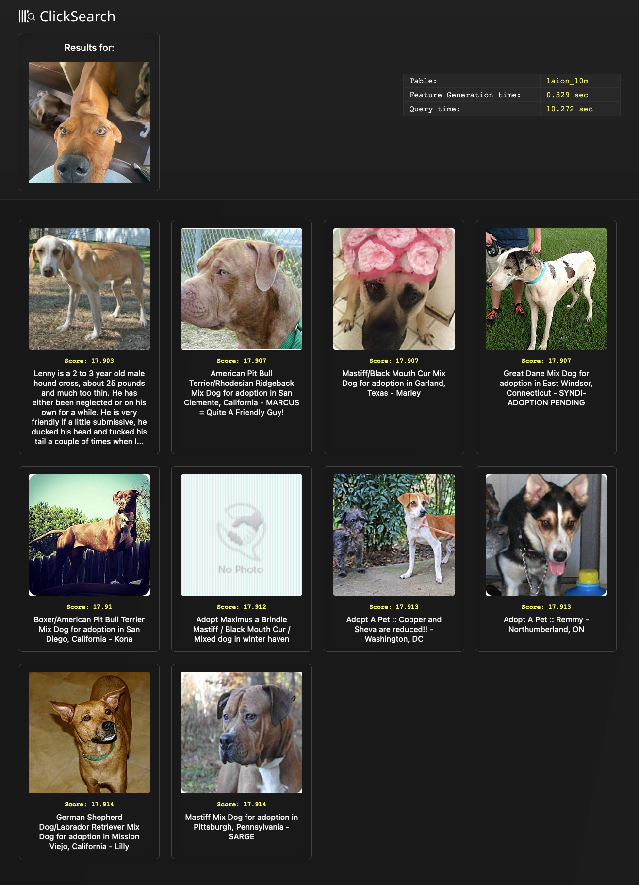
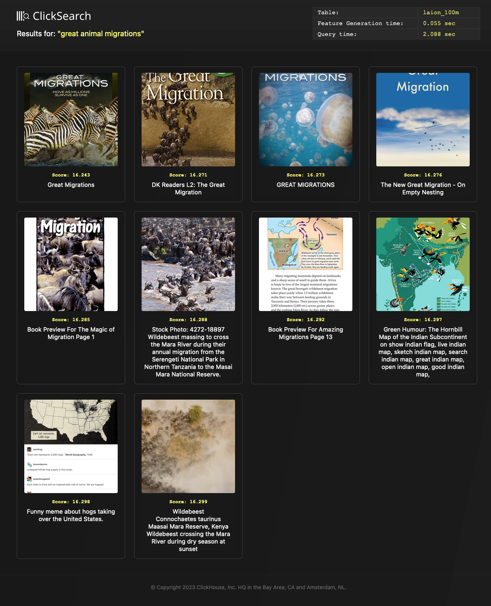
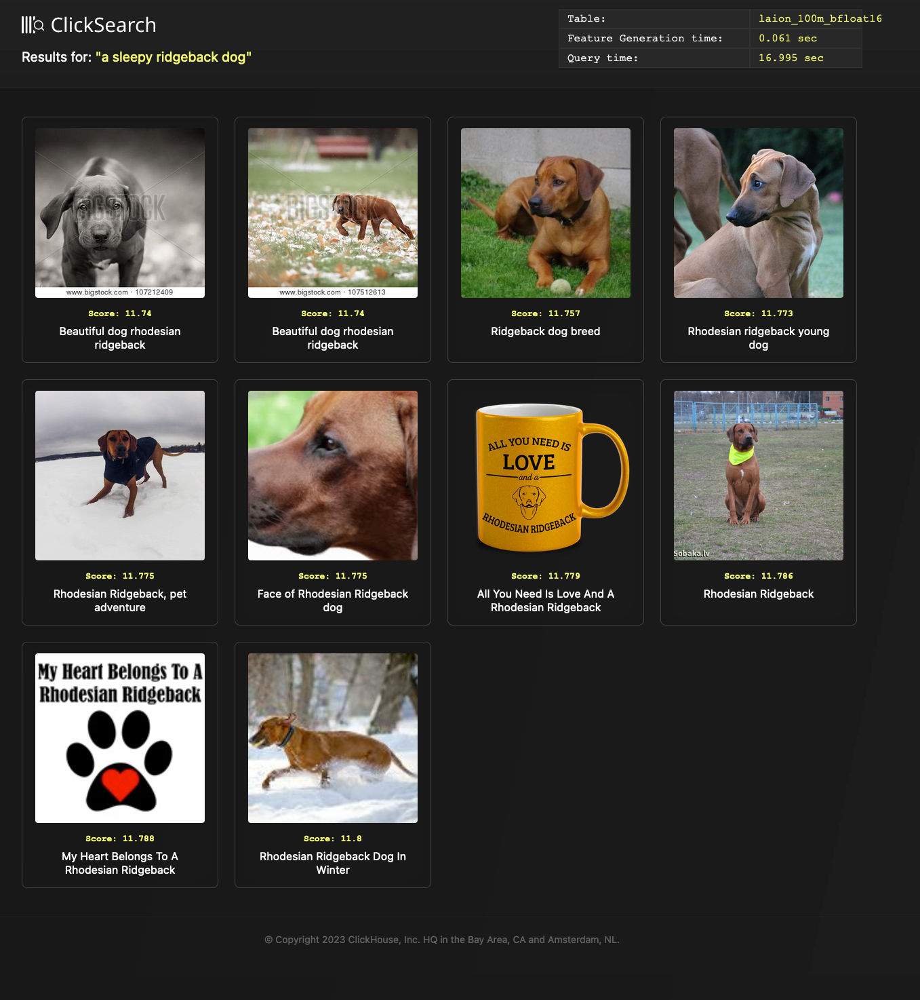
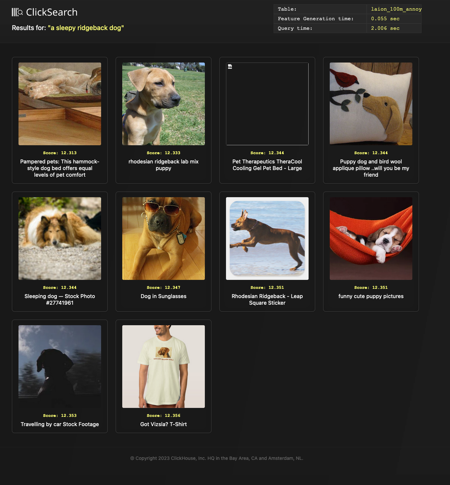
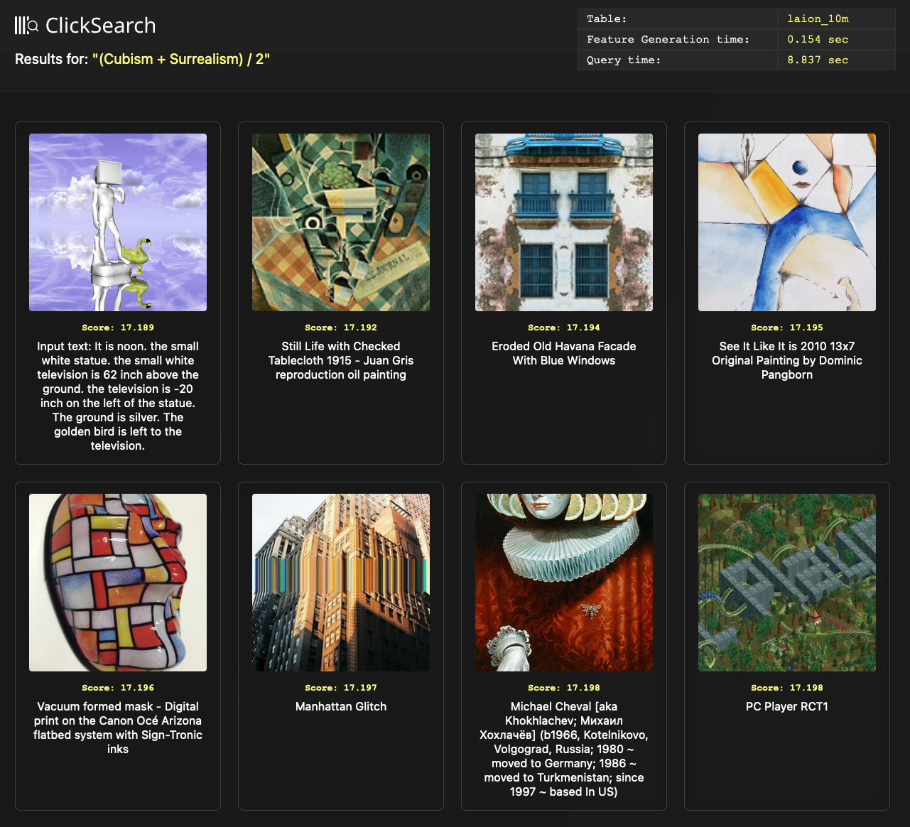

# Vector Search - Part 2

This blog post continues our series on Vector Search, building on the previous post where we provided an overview of what Vector Search is, its relation to historical inverted index-based approaches, possible use cases for which it currently delivers value, and some high-level implementation approaches. In this post, we explore Vector Search in relation to ClickHouse in detail through practical examples as well as answering the question, "When should I use ClickHouse for Vector Search?"

For our examples, we utilize a ClickHouse Cloud cluster with a total of 60 cores and 240GB of RAM per node. These examples should, however, be reproducible on an equivalently sized self-managed cluster. Alternatively, start your ClickHouse Cloud cluster today, receive $300 of credit,  let us worry about the infrastructure, and get querying!

## When should i use ClickHouse for Vector Search?

Prior to showing practical examples, let us address the main question most users have when discovering vector support in ClickHouse - When should I use ClickHouse for Vector Search?

Firstly, ClickHouse is not "just" a vector database - it's a real-time OLAP database with full SQL support and a wide range of analytical functions to assist users in writing analytical queries. Some of these functions and data structures allow ClickHouse to perform distance operations between vectors, thus allowing it to be used as a vector database. A fully parallelized query pipeline that utilizes the full compute capability of a machine allows this matching to be performed very quickly, especially when performing exact matching through a linear scan over all rows - delivering performance comparable to dedicated vector databases. High compression levels, tunable through custom compression codecs, allows very large datasets to be potentially stored and queried. With a fully-fledged storage engine, ClickHouse is not memory-bound - allowing multi-TB datasets containing embeddings to be queried. Notably, the capabilities which allow the distance between 2 vectors to be computed are just another SQL function - allowing them to be combined with more traditional SQL filtering and aggregation capabilities. This allows vectors to be stored and queried alongside metadata (and even rich text). Finally, experimental Approximate Nearest Neighbour (ANN) indices, a feature of vector databases to allow faster approximate matching of vectors, provide a promising development that may further enhance the vector matching capabilities of ClickHouse. 

In summary, ClickHouse is appropriate for vector matching when any of the following are true:

- You need to perform linear distance matching over very large vector datasets and wish to parallelize and distribute this work across many CPU cores with no additional work or configuration.
- You need to match on vector datasets of a size where relying on memory-only indices is not viable either due to cost or availability of hardware
- You would benefit from full SQL support when querying your vectors and wish to combine matching will filtering on metadata (and text) and/or aggregation or join capabilities.
- You already have related data in ClickHouse and do not wish to incur the overhead and cost of learning another tool for a few million vectors.
- You have an existing embedding generation pipeline that produces your vectors and do not require this capability to be native to your storage engine.
- You principally need fast parallelized exact matching of your vectors and do not need a production implementation of ANN (yet!)
- You're an experienced or curious ClickHouse user and trust us to improve our vector matching capabilities and wish to be part of this journey!

While this covers a wide range of use cases, there are cases ClickHouse would be less appropriate as a vector storage engine, and you may wish to consider alternatives such as [Faiss](https://github.com/facebookresearch/faiss) or a dedicated vector database. In the interests of honesty and transparency, ClickHouse is probably not the best choice if:

- Your vector dataset is small and easily fits in memory.
- You have no additional metadata with the vectors and need distance matching and sorting only.
- You have a very high QPS, greater than several thousand per second. Typically, for these use cases, the dataset will fit in memory, and matching times of a few ms are required. While ClickHouse can serve these use cases, a simple in-memory index is probably sufficient.
- You need a solution that includes embedding generation capabilities, where a model can be integrated at insert and query time. Vector databases, such as Weviate, have pipelines specifically designed for this use case and be more appropriate should you seek a solution with OOTB models and accompanying tooling.

With the above in mind, lets explore the vector capabilities of ClickHouse.

## Selecting a dataset

As discussed in our previous post, Vector search requires embeddings (vectors representing a contextual meaning) to be generated for a dataset. This requires a model to be produced through a Machine Learning training process, for which the dataset can subsequently be passed through to generate an embedding for each object, e.g., an image or piece of text. This process is typically involved and the subject of significant research. With some of the latest approaches utilizing a class of algorithms known as Transformers, this process is beyond the scope of this specific post. We defer this to a later post and use a pre-prepared set of embeddings for the focus of this post: Vector Search in ClickHouse. 

Fortunately, the embeddings for test datasets are available for download. Wanting to ensure we utilized a test set of sufficient size with respect to both the number of vectors and their dimensionality, we have selected the LAION 5 billion test set. This consists of embeddings, with a dimension of 768, for several billion public images on the internet and their captions. As of the time of writing, we believe this to be the largest available dataset of pre-computed embeddings available for testing. 

As well as providing billions of embeddings with high dimensionality, this test set includes metadata useful for illustrating the analytics capabilities of ClickHouse and how they can be used in conjunction with Vector search. This metadata is distributed separately from the embeddings themselves, which are provided in `npy` format. We have combined these to produce a 6TB parquet dataset our users can download and use to reproduce examples.

### The LAION dataset

The LAION dataset was created with the explicit purpose of testing Vector search at scale. With over 5 billion embeddings in total, the dataset was generated for a set of images collected through a public crawl of the internet. An embedding is generated for each image and its associated caption - giving us two embeddings for each object. For this post, we have focused on the English subset only, which consists of a reduced 2.2 billion objects. Although each of these objects has two embeddings, one for its image and one caption, respectively, we represent each object as a single row - giving us almost 2.2 billion rows in total and 4.4 billion vectors. For each row, we include the metadata as columns, which captures information such as the image dimensions and the similarity of the image and caption embedding. This similarity, a cosine distance, allows us to identify objects where the caption and image do not conceptually align - potentially filtering these out in queries (see later).

We want to acknowledge the effort required by the original authors to collate this dataset and produce the embeddings for public use. We recommend reading the full [process for generating](https://laion.ai/blog/laion-5b/) this dataset, which overcame a number of challenging data engineering challenges, such as downloading and resizing billions of images efficiently and in a reasonable time and at at low(ish) cost.

### The CLIP Model

Before we describe how the LAION dataset can be downloaded and inserted into ClickHouse, we briefly describe how the embeddings for the images and caption are generated. The key outcome of this training process is that the embeddings for the two data types are comparable, i.e., if the vector for an image and caption are close, then they can be considered conceptually similar. This ability to compare data types requires a multi-modal machine learning algorithm. For this, the team at LAION utilized a trained [CLIP model proposed by OpenAI](https://openai.com/research/clip). We briefly describe this below and encourage readers to read the full approach as [published by OpenAI](https://arxiv.org/pdf/2103.00020.pdf).

CLIP (Contrastive Language–Image Pre-training) is a multi-modal model developed with a focus on addressing the challenge of zero-shot transfer. This aims to provide the ability to classify images with a relevant category for previously unknown images not seen during the training process. These prediction classes are also not required to be explicitly part of the original training set. This is particularly useful in scenarios where the training data may be limited or where new classes emerge over time. It allows the model to adapt and classify instances into new classes without requiring retraining on the entire dataset. 

To achieve this, CLIP uses a contrastive pre-training step to train a neural network, with a dataset of 400m images and text pairs from the internet as a training source. This requires a proxy or cost optimization goal that relies on the text and images being encoded into a high-dimensional space using an encoder. The objective of the learning process is then to maximize the cosine distance between the equivalent encodings of an image and their known text snippets. 

More specifically, a "good" model would result in close embeddings with respect to distance, or a high value close to 1 for cosine similarity, for an image and its associated vector. This is illustrated below in the image below, where T1 is the embedded representation of the 1st image's snippet, and I1 is the encoding of the image itself. This means we want to maximize the diagonal of this matrix, where our images and text coincide. Additionally, we want to minimize the cost of the grey squares where the image and embeddings don't align. The trick of CLIP is to minimize and maximize these errors simultaneously. This is based on a  symmetric cross-entropy loss function that performs this cost optimization in both directions, i.e., I1, T2, and T2, I1. This isn't a cheap process! On 400m, this took around 30 days and needed 592 V100 GPUs (about $1m on AWS on-demand instances). 


// image

For the actual encoding of the images and test, the authors of CLIP used Resnet50 and Vision Transformer (ViT) for the image encoding and a Transformer (similar to GPT-2 style) as the backbone for the text encoder. While we don't use it in the post, CLIP has a 2nd step for zero-shot classification. Where previous approaches to this required the user to have known classification labels for the data beforehand (maybe training a logistical regression on the image features and target classes), the CLIP model imposes no such constraints. Instead, users simply provide a set of possible text snippets and encode these into text embeddings. The image for which a snippet is required is then also encoded, with CLIP providing a similarity score for the closest snippet - the prediction in effect.


//image


CLIP has proved effective at learning visual representations of text with promising results in OCR, geolocalisation, and action recognition. Despite this, it does have some limitations in some domains, with no depth perception making it poor at distance prediction. Furthermore, it has been shown to struggle with similar images as well as counting objects.

For demonstrating vector search in ClickHouse, we utilise precomputed embeddings for around 2b images and their corresponding text snippets using the [clip retrieval tool](https://github.com/rom1504/clip-retrieval). These embeddings were generated using a CLIP model, specifically ViT-L/14, [trained by LAION](https://laion.ai/blog/large-openclip/). 

Importantly, the authors also discarded images where the cosine similarity with the text caption was less than 0.28. Further filtering by image size, caption length, possible illegality, and removal of possible duplicates reduced the total dataset from over 50 billion.

By loading the resulting dataset into ClickHouse, we can find similar images to text prompts or possible snippets for specified images.


### Combining the data

The LAINON dataset is downloadable from a number of sources. Selecting the English subset, we utilized the version hosted by Hugging Face. This service relies on Git Large File Storage (LFS), which requires a client to be installed to download files. Once installed, downloading the data requires a single command. For this, ensure you have at least 20TB of disk space available.

```bash

```

Once downloaded, the users is presented with 3 folders. Two of these contain embeddings in the format XXX (effectively a multi-dimensional array format) for the images and captions. A third directory contains Parquet files containing the metadata for each image+caption pair. While Parquet is a [well supported format]() in ClickHouse, npy is currently not readable - although we have plans [to support]().

```bash
ubuntu@ip-172-31-2-70:/data$ ls -l ./laion2b-en-vit-l-14-embeddings
total 456
drwxrwxr-x 2 ubuntu ubuntu  77824 May 16 12:28 img_emb
drwxrwxr-x 2 ubuntu ubuntu 110592 May 16 12:27 metadata
drwxrwxr-x 2 ubuntu ubuntu 270336 May 16 12:28 text_emb
```

To load this data into ClickHouse, we wanted to produce a single row per embedding pair with the metadata for enrichment. This would require a process that merged the respective embeddign and metadata for each object. Considering that vectors in ClickHouse can be represented as an array of Floats, a JSON row produced as a result of this process may look like the following:

```json
{
  "key": "196060024",
  "url": "https://cdn.shopify.com/s/files/1/1194/1070/products/s-l1600_16_-_Copy_110x110@2x.jpg?v=1477414012",
  "caption": "MERCEDES BENZ G65 RIDE-ON TOY CAR WITH PARENTAL REMOTE |  CHERRY",
  "similarity": 0.33110910654067993,
  "width": "220",
  "height": "147",
  "original_width": "220",
  "original_height": "147",
  "status": "success",
  "NSFW": "UNLIKELY",
  "exif": {
    "Image Orientation": "Horizontal (normal)",
    "Image XResolution": "72",
    "Image YResolution": "72",
    "Image ResolutionUnit": "Pixels/Inch",
    "Image YCbCrPositioning": "Centered",
    "Image ExifOffset": "102",
    "EXIF ExifVersion": "0210",
    "EXIF ComponentsConfiguration": "YCbCr",
    "EXIF FlashPixVersion": "0100",
    "EXIF ColorSpace": "Uncalibrated",
    "EXIF ExifImageWidth": "220",
    "EXIF ExifImageLength": "147"
  },
  "text_embedding": [
    0.025299072265625,
    ...
    -0.031829833984375
  ],
  "image_embedding": [
    0.0302276611328125,
    ...
    -0.00667572021484375
  ]
}
```

Fortunately, although the metadata and embeddings are split across multiple files their naming and ordering are aligned. For example, the 1st row in the files `0000.parquet`, `img_emebedding/0000.XXX` are `text_emebedding/0000.XXX` represent the same object and can be concatenated. This makes parallelizing the merging of this data relatively trivial - we can simply parallelize by file name.

The full code for this process can be found [here](). In summary, this utilizes a worker pool of a configurable size. A process can take a job from this pool containing a file name pattern e.g. `0000`. Each file is in turn processed sequentially by a seperate process, with merged objects produced one row at a time. This data is written to a seperate directory in Parquet format using the same file name. With over 2300 original file patterns, each containing approximately 1m entries, this process has sufficient opportunity to be parallelized - a 48 core machine processes the entire dataset in under 90mins. A few key implementation points for those readers interested in the details:

- Lazy iteration over parquet files in batches to keep the memory low and avoiding loading them entirely into memory
- avoid loading `npy` files on top heap to keep memory down using a `mmap_mode`
- img and text files can be missing (so create 0 entries for these)

The final script can be invoked as follows, assuming the user is the parent directory of , once dependencies have been installed with Pip.

```bash

python generate.py --input_folder ./laion2b-en-vit-l-14-embeddings --output_folder ./laion_combined --processes 32

```

The final 2313 Parquet files generated as a result of this process, consume around 5.9TB of disk space.

We should note that whilst Parquet usually acts as an excellent platform independent storage format for analytics data, as noted by our recent blog post, it is sub-optinal as a vector storage medium. None of the supported encodings are particularly effective at compressing sequences of floating point numbers, result in a large file size. Ideally, the npy format would be more flexible (alllowing support for metadata) or Parquet would support compression techniques specifically targeted for such floating pointing data. We would welcome advice here or suggestions for alternative formats that we could potentially support in ClickHouse.

## Storing Vectors in ClickHouse

With our Parquet files generated, loading this data into ClickHouse requires a few simple steps. The following shows our proposed table schema:

```sql
CREATE TABLE laion
(
    `_file` LowCardinality(String),
    `key` String,
    `url` String,
    `caption` String,
    `similarity` Float64,
    `width` Int64,
    `height` Int64,
    `original_width` Int64,
    `original_height` Int64,
    `status` LowCardinality(String),
    `NSFW` LowCardinality(String),
    `exif` Map(String, String),
    `text_embedding` Array(Float32),
    `image_embedding` Array(Float32),
    `orientation` String DEFAULT exif['Image Orientation'],
    `software` String DEFAULT exif['Image Software'],
    `copyright` String DEFAULT exif['Image Copyright'],
    `image_make` String DEFAULT exif['Image Make'],
    `image_model` String DEFAULT exif['Image Model']
)
ENGINE = MergeTree
ORDER BY (height, width, similarity)
```

Note how our embeddings are stored as [`Array(Float32)`]() columns. In addition to some useful columns such as `height` and `width` we have a `exif` column. This column contains metadata we can later use for filtering and aggregation. We have mapped as a `Map(String,String)` for flexibility and schema succientness - the column contains over 100k unique meta labels, making it challenging to declare explictly as either a `Tuple` (this would require every sub column to be declared) and inappropriate for the JSON [experimental json object type](). While the Map column allows to easily store this data, accessing a sub key requires all of the keys to be loaded from the column - potentially slowing down queries. We have therefore extracted 5 properties of interest to the root for later analytics using the [`DEFAULT` syntax](https://clickhouse.com/docs/en/sql-reference/statements/create/table#default). For users interested in the full list of available meta properties, the following query can be used to identify available Map keys and their frequency:

```sql
SELECT
    arrayJoin(mapKeys(exif)) AS keys,
    count() AS c
FROM laion
GROUP BY keys
ORDER BY c DESC
LIMIT 10
```

Our schema also includes add a `_file` column, denoting the original Parquet file from which this data is generated. This allows us to restart a specific file load, should it fail during insertion into ClickHouse.

For future usage, we loaded this data into a public S3 bucket. To insert this data into ClickHouse, users can execute the following query:

```sql
INSERT INTO laion SELECT * FROM s3('https://datasets-documentation.s3.eu-west-3.amazonaws.com/laion/*.parquet')
```

Note: This is a considerable amount of data to load with an unoptimized load taking around XX hrs. Users can target specific subsets using glob patterns e.g. `s3(https://datasets-documentation.s3.eu-west-3.amazonaws.com/laion/00*.parquet)`. This can also be used to build a more robust insertion process, since the above is subject to interruptions such as network connectivity issues. We would recommened users thus batch the loading process. The `_file` column can be used to reconcile any loading issues, by confirming the count in ClickHouse with that in the original Parquet files.

For the examples below, we have created tables of various sizes with a suffix denoting the number of rows e.g. laion_100m contains 100 million rows. These are created with approrpriate glob patterns e.g.

```sql
INSERT INTO laion_100m SELECT * FROM s3('https://datasets-documentation.s3.eu-west-3.amazonaws.com/laion/00*.parquet')
```

## Compression performance

The column orientated structure of ClickHouse means the values for a column are sorted and writen in sequence. The clustering of identical and similar values on disk, leads typically to high compression ratios. ClickHouse even offers a number of [schemas and codecs](https://clickhouse.com/blog/optimize-clickhouse-codecs-compression-schema) to allow users to tune their configuration based on the properties of their data. For arrays of floating point numbers, high compression is harder to achieve since the values of the embeddings have no domain agnostic properties to exploit. The full 32 bit range is utilized, and for most codecs the relation between adjacent values in an embedding is random. For this reason, we typically the ZSTD codec for compressing embeddings. Below we show the compression ratio for 4 tables of increasing size: 1m, 10m, 100m and 2b rows.

``sql
SELECT
    table,
    name,
    formatReadableSize(sum(data_compressed_bytes)) AS compressed_size,
    formatReadableSize(sum(data_uncompressed_bytes)) AS uncompressed_size,
    round(sum(data_uncompressed_bytes) / sum(data_compressed_bytes), 2) AS ratio
FROM system.columns
WHERE (table IN ('laion_100m', 'laion_1m', 'laion_10m', 'laion_2b')) AND (name IN ('text_embedding', 'image_embedding'))
GROUP BY
    table,
    name
ORDER BY table DESC

┌─table──────┬─name────────────┬─compressed_size─┬─uncompressed_size─┬─ratio─┐
│ laion_1m   │ text_embedding  │ 1.60 GiB        │ 2.50 GiB          │  1.56 │
│ laion_1m   │ image_embedding │ 1.61 GiB        │ 2.50 GiB          │  1.55 │
│ laion_10m  │ text_embedding  │ 18.36 GiB       │ 28.59 GiB         │  1.56 │
│ laion_10m  │ image_embedding │ 18.36 GiB       │ 28.59 GiB         │  1.56 │
│ laion_100m │ text_embedding  │ 181.64 GiB      │ 286.43 GiB        │  1.58 │
│ laion_100m │ image_embedding │ 182.29 GiB      │ 286.43 GiB        │  1.57 │
│ laion_1b   │ image_embedding │ 1.81 TiB        │ 2.81 TiB          │  1.55 │
│ laion_1b   │ text_embedding  │ 1.81 TiB        │ 2.81 TiB          │  1.55 │
└────────────┴─────────────────┴─────────────────┴───────────────────┴───────┘

6 rows in set. Elapsed: 0.006 sec.
```

While compression rates can [usually be influenced by primary key selection](), this constant compression ratio of 1.56 is unlikely to be impacted by how the data is sorted. The compression level of the ZSTD codec can be increased from its default value of 1 in ClickHouse Cloud. This delivers around a 10% improvement, compressing our data by 1.71 on a 10m row sample:

```sql

SELECT
    table,
    name,
    formatReadableSize(sum(data_compressed_bytes)) AS compressed_size,
    formatReadableSize(sum(data_uncompressed_bytes)) AS uncompressed_size,
    round(sum(data_uncompressed_bytes) / sum(data_compressed_bytes), 2) AS ratio
FROM system.columns
WHERE (table IN ('laion_10m_zstd_3')) AND (name IN ('text_embedding', 'image_embedding'))
GROUP BY
    table,
    name
ORDER BY table DESC

┌─table────────────┬─name────────────┬─compressed_size─┬─uncompressed_size─┬─ratio─┐
│ laion_10m_zstd_3 │ text_embedding  │ 16.68 GiB       │ 28.56 GiB         │  1.71 │
│ laion_10m_zstd_3 │ image_embedding │ 16.72 GiB       │ 28.56 GiB         │  1.71 │
└──────────────────┴─────────────────┴─────────────────┴───────────────────┴───────┘

2 rows in set. Elapsed: 0.026 sec.

```

Note higher values for ZSTD will slow down compression and data insertion, although decompression speeds should remain reasonably constant (around [20% variance](https://engineering.fb.com/2016/08/31/core-data/smaller-and-faster-data-compression-with-zstandard/)).

The compression point of floating point numbers is an area of research, with a number of lossy candidates based on quantization, such as [SZ algorithm](https://szcompressor.org/), possible additions to ClickHouse.

Other options include reducing the precision of our floating points to 16bits. We discuss this below.

## Searching Vectors in ClickHouse

In order to perform a vector search in ClickHouse, we require:

 - **An input vector** representing the concept of interest. In our case, this can either be an encoded image or piece of text. This must be encoded using the same CLIP model as that used to generate our data and have the same number of dimensions - 768.
 - **Distance functions** for comparing the search vectors with those stored in ClickHouse. We can compare our input vector to either the image or caption embedding, Note hat this does not require am embedding from the same data type to be compare e.g. embeddings generated from text can be compared to the column `image_embedding` to find conceptually similar images.


### Distance functions

 ClickHouse supports a wide range of Distance functions. For this post, we focus on two which are commonly used in Vector search:

  - cosineDistance(vector1, vector2) - This provides us a with a Cosine similarity between 2 vectors. More specifically, this measures the cosine of the angle between two vectors i.e. the dot product divided by the length. This produces a value between -1 and 1, where 1 indicates the two embeddings are [proportional](https://en.wikipedia.org/wiki/Proportionality_(mathematics)) and thus conceptually identical. A column name and input embedding can be parsed for vector search.
  - L2Distance(vector1, vector2) - This measures the L2 distance between 2 points. Effectively this si the Eucildean distance between two input vectors i.e. length of the line between the points represented by the vectors. For embeddings, the lower distance the mroe conceptually simlar the source objects.

Both of the functions compute a score which can be used to locate similar embeddings, and thus images and captions which are conceptually aligned. The appropriate metric to used depends if you wish to consider magnitude in your score (see [https://cmry.github.io/notes/euclidean-v-cosine](https://cmry.github.io/notes/euclidean-v-cosine)) and depends on the model itself. Other models might use slight variants of these two. For our pre-trained CLIP model, the L2Distance represents the most appropriate distance function based on the [internal scoring used for the official examples](https://codeandlife.com/2023/01/26/mastering-the-huggingface-clip-model-how-to-extract-embeddings-and-calculate-similarity-for-text-and-images/).

For a full list of available distance, as well as vector normalization, functions see [here](). We would love to hear how you utilize these to search your embeddings!

### Generating an input vector

To generate an input vector, we need to produce an embedding for either a search image or caption. This requires us to download and invoke the CLIP model. This is easily achieved through a simple python script. The isntructions for installing the dependenecies for this script can be found [here](). We show this script below:

```bash
#!/usr/bin/python3
import argparse
from PIL import Image
import clip
import torch

if __name__ == '__main__':
    parser = argparse.ArgumentParser(
        prog='generate',
        description='Generate CLIP embeddings for images or text')
    group = parser.add_mutually_exclusive_group(required=True)
    group.add_argument('--text', required=False)
    group.add_argument('--image', required=False)
    parser.add_argument('--limit', default=1)
    parser.add_argument('--table', default='laion_1m')
    args = parser.parse_args()
    device = "cuda" if torch.cuda.is_available() else "cpu"
    print(f"using {device}")
    device = torch.device(device)
    model, preprocess = clip.load("ViT-L/14")
    model.to(device)
    images = []
    if args.text:
        inputs = clip.tokenize(args.text)
        with torch.no_grad():
            print(model.encode_text(inputs)[0].tolist())
    elif args.image:
        image = preprocess(Image.open(args.image)).unsqueeze(0).to(device)
        with torch.no_grad():
            print(model.encode_image(image)[0].tolist())
```


This version of the script accepts either text or an image path as input, outputing the embedding to the command line for copying into a ClickHouse query. Note that this will exploit cuda-enabled GPUs if present. This can make a dramatic difference to the generation time - when tested on a Mac M1 2021 generation without gpu support takes around 1sec vs Nsecs on a [p3.2xlarge](https://aws.amazon.com/ec2/instance-types/p3/) with 1 GPU core.

Below we convert the text "a sleepy [ridgeback dog](https://en.wikipedia.org/wiki/Rhodesian_Ridgeback)" into a embedding.

```
python generate.py --text "a sleepy ridgeback dog"

[0.5736801028251648, 0.2516217529773712, ...,  -0.6825592517852783]
```

For purposes of brevity, we have cropped the full embedding result which can be found [here]().

### Putting it together

Using the embedding generated above and the Eucilean distance function, we can identify conceptually similar images. The query below matches on the `image_embedding` column, computing a score and sorting by this. We require a `similarity` score of atleast 0.2, to ensure the original text and image embeddings are considered similar - thereby filtering out noise.

```sql
SELECT
    url,
    caption,
    L2Distance(image_embedding, [0.5736801028251648, 0.2516217529773712, ...,  -0.6825592517852783]) AS score
FROM laion_10m
ORDER BY score ASC
LIMIT 2
FORMAT Vertical

Row 1:
──────
url:     https://thumb9.shutterstock.com/image-photo/stock-photo-front-view-of-a-cute-little-young-thoroughbred-african-rhodesian-ridgeback-hound-dog-puppy-lying-in-450w-62136922.jpg
caption: Front view of a cute little young thoroughbred African Rhodesian Ridgeback hound dog puppy lying in the woods outdoors and staring.
score:   12.262669854099084

Row 2:
──────
url:     https://m.psecn.photoshelter.com/img-get2/I0000_1Vigovbi4o/fit=180x180/fill=/g=G0000x325fvoXUls/I0000_1Vigovbi4o.jpg
caption: SHOT 1/1/08 3:15:27 PM - Images of Tanner a three year-old male Vizsla sleeping in the sun on the couch in his home in Denver, Co. The Hungarian Vizsla, is a dog breed originating in Hungary. Vizslas are known as excellent hunting dogs, and also have a level personality making them suited for families. The Vizsla is a medium-sized hunting dog of distinguished appearance and bearing. Robust but rather lightly built, they are lean dogs, have defined muscles, and are similar to a Weimaraner but smaller in size. The breed standard calls for the tail to be docked to two-thirds of its original length in smooth Vizslas and to three-fourths in Wirehaired Vizslas..(Photo by Marc Piscotty/ © 2007)
score:   12.265198669961046

2 rows in set. Elapsed: 2.637 sec. Processed 10.00 million rows, 32.69 GB (3.79 million rows/s., 12.40 GB/s.)

```

These results seem sensible based on the caption. As an alternative we can reverse the modals, passing [an image]() of a sleeping dog (the author's dog, a ridgeback 'Kibo' for you dog lovers) to the encoding function. We then repeat the above query, using the `text_embedding` column. 


```bash
python generate.py --image ridgeback.jpg

[0.17179889976978302, 0.6171532273292542, ...,  -0.21313616633415222]
```


```sql
SELECT
    url,
    caption,
    L2Distance(text_embedding, [0.17179889976978302, ..., -0.21313616633415222]
) AS score
FROM laion_10m
ORDER BY score ASC
LIMIT 2
FORMAT Vertical


Row 1:
──────
url:     https://i.pinimg.com/236x/ab/85/4c/ab854cca81a3e19ae231c63f57ed6cfe--submissive--year-olds.jpg
caption: Lenny is a 2 to 3 year old male hound cross, about 25 pounds and much too thin. He has either been neglected or on his own for a while. He is very friendly if a little submissive, he ducked his head and tucked his tail a couple of times when I...
score:   17.903361501636233

Row 2:
──────
url:     https://d1n3ar4lqtlydb.cloudfront.net/c/a/4/2246967.jpg
caption: American Pit Bull Terrier/Rhodesian Ridgeback Mix Dog for adoption in San Clemente, California - MARCUS = Quite A Friendly Guy!
score:   17.90681726342255

2 rows in set. Elapsed: 2.628 sec. Processed 10.00 million rows, 32.69 GB (3.80 million rows/s., 12.44 GB/s.)

```

These results again seem sensible. While sufficient for adhoc testing, this can be alittle tedious when testing a large number of images - copying 768 floating point values is awkward!. We have thus provided a simple result generator [search.py](), which encodes the passed image or text and also executes the query, rendering the query results as a local html file. This file is then automatically be opened in the local browser.  The result file for the above query is shown below:

```bash
python search.py search --image ridgeback.jpg
```





For both of these above examples, we have matched embeddings for different modals e.g.  embeddings from image inputs are matched against the `text_embedding` column and vise versa. This aligns with the original model training as described earlier, and is the intended application. While matching input embeddings against the same type has been explore, previous attempts to do this have resulted in mixed [results](https://github.com/openai/CLIP/issues/1).

## Scaling Vector search

Our previous examples have used a 10m sample of the 2 billion dataset. Due to the huge number of images in the dataset, the actual results produced by our search phrases and images remained acceptable. However, users will still be curious as to how the linear scan techniques perform as the number of images increases. Below we show the performance of a simple [`L2Distance` search](https://gist.github.com/gingerwizard/dce9cecb59213a7b4911c0afccf98141) on the `image_embedding` column, sorting by the compute score, on tables of increasing size. This is executed on using our 3 node ClickHouse Cloud cluster, where each node has 40 cores and 240GB. We record both the cold time (initial search) and the fastest time of 5 searches - thus giving us the performance once local filesystem caches are populated.  Importantly, this query is not distributed in its execution and will only utilise one node. We utilize the default `ZSTD(1)` compression for our embeddings. Sizes here are for the `image_embedding` column only.


|    Table   | Number rows | Cold (secs) | Hot (secs) |
|:----------:|-------------|-------------|------------|
| laion_1m   | 1m          | 2.299s      | 0.292s     |
| laion_10m  | 10m         | 12.851s     | 2.406s     |
| laion_100m | 100m        | 111.857s    | 24.444s    |
| laion_1b   | 1 billion   | 1337.886s   | 1068.339s  |
| laion_2b   | 2 billion   | 3163.470s   | 2730.828   |

As shown, presence of data in the system caches makes a considerable difference on the performance of our linear scans. Performance remains approximately linear while our compressed data size can fit in RAM. Once this is no longer possible, performance degrades and is I/O bound. This highlights the importance of compression of our floating point data and the importance of potentially filtering our data before doing distance computations.

### Using SQL

All of the previous examples rely on passing an input vector and linearly scanning every row for the those with the closest distance. Our dataset, however, contains alot of useful metadata that we can use to limit our rows before scoring. For example, suppose we wish to find non copyrighted images for "great animal migrations", where the size was atleast 300px*500px and the caption similarity satisified a higher cosine similarity score of 0.3. Our Map `exif` column contains our neccessary DateTime as a sub key, with the other metadata existing as columns on the root. Formulating this as a SQL query is simple. Below we execute this over 2 billion images.

```sql
SELECT
    url,
    caption,
    L2Distance(image_embedding, [<embedding>]) AS score
FROM laion_100m
WHERE (width >= 300) AND (height >= 500) AND (copyright = '') AND similarity > 0.3
ORDER BY score ASC
LIMIT 10
FORMAT Vertical


Row 1:
──────
url:     https://aentcdn.azureedge.net/graphics/items/sdimages/a/500/3/6/5/4/1744563.jpg
caption: Great Migrations
width:   366
height:  500
score:   16.242750635008512

Row 2:
──────
url:     https://naturefamiliesdotorg.files.wordpress.com/2017/01/on-the-move.jpg?w=418&h=557
caption: on-the-move
width:   384
height:  512
score:   16.26983713529263

10 rows in set. Elapsed: 2.010 sec. Processed 6.82 million rows, 22.52 GB (3.39 million rows/s., 11.20 GB/s.)
```

Our choice of primary keys in our schema is somewhat optimal for this query, but it illustrates the potential for using SQL and metadata to limit your vector comparisons to a subset. In this specific case we query over 100m vectors but restrict the distance matching to fewer than 7m.

We have also added the ability to pass an additional filter to our search.py, allowing us to verify the quality of the above matches:

```bash
python search.py search --filter "(width >= 300) AND (height >= 500) AND (copyright = '') AND simularity > 0.3" --text "great animal migrations"
```



As well as enabling filtering through a familar syntax, SQL allows us to allow perform aggregations. As a column-orientated database, ClickHouse is well suited to this task. Suppose we wanted to identify the primary camera models used for "safari pictures". Below we use the embedding for "safari pictures".


```sql
WITH results AS
    (
        SELECT
            image_make,
            image_model,
            L2Distance(image_embedding, [<embedding>]) AS score
        FROM laion_100m
        WHERE (image_make != '') AND (image_model != '')
        ORDER BY score ASC
        LIMIT 1000
    )
SELECT
    image_make,
    image_model,
    count() AS c
FROM results
GROUP BY
    image_make,
    image_model
ORDER BY c DESC
LIMIT 10

┌─image_make────────┬─image_model───────────┬──c─┐
│ Canon             │ Canon EOS 7D          │ 64 │
│ Canon             │ Canon EOS-1D X        │ 51 │
│ Canon             │ Canon EOS 5D Mark III │ 49 │
│ NIKON CORPORATION │ NIKON D700            │ 26 │
│ NIKON CORPORATION │ NIKON D800            │ 24 │
│ Canon             │ Canon EOS 5D Mark II  │ 23 │
│ NIKON CORPORATION │ NIKON D810            │ 23 │
│ NIKON CORPORATION │ NIKON D7000           │ 21 │
│ Canon             │ Canon EOS 40D         │ 18 │
│ Canon             │ Canon EOS 60D         │ 17 │
└───────────────────┴───────────────────────┴────┘

10 rows in set. Elapsed: 23.897 sec. Processed 100.00 million rows, 286.70 GB (4.18 million rows/s., 12.00 GB/s.)
```

Clearly Canon's should be your camera of choice for your next safari. Note here we only use the top 1000 results. Unlike cosine Distance, which is unbounded, euclidean distance has no upper limit - making imposing a threshold challenging.

As well using primary indices to accelerate filtering and reduce the number of distance comparisons required, we can also utilize secondary indices. When searching for text captions, using images, we may impose word restrictions. For example, suppose we limit our safafi pictures to those containing lions. As well as including this as information within our embedding, we can also impose a token restriction - requiring the `caption` column to contain `lions`. To accelerate this specific concept + text search query, we can [exploit inverted indices](https://clickhouse.com/blog/clickhouse-search-with-inverted-indices). These provide more traditional search querying, found in technologies such as Elasticsearch, and [described in our previous post]().

Our initial search might look something like the following - utilizing the embedding for the [following picture]():

```sql
SELECT url, caption, L2Distance(text_embedding, [<embedding>]) AS score FROM laion_100m WHERE hasToken(lower(caption), 'lions') ORDER BY score ASC LIMIT 10 FORMAT Vertical

```

To accelerate this, we add an inverted index for the `caption` column to table of 100m rows.

```sql
SET allow_experimental_inverted_index=1
ALTER TABLE laion_100m ADD INDEX caption_idx(lower(caption)) TYPE inverted;
ALTER TABLE laion_100m MATERIALIZE INDEX caption_idx;
```

Repeating our previous query, we can see this delivers significant improvement. The inverted index can be used to limit the number of rows for our distance comparison to X, reducing the time from X secs to Y.

```sql
SELECT url, caption, L2Distance(text_embedding, [<embedding>]) AS score FROM laion_100m WHERE hasToken(lower(caption), 'lions') ORDER BY score ASC LIMIT 10 FORMAT Vertical


```


As we can see, the result still remain relevant.


//image


## Improving compression

Our previous schema and resulting compression statistics were based on storing our vectors as the type `Array(Float32)`.For some models, 32-bit floating point precision is not required and similar matching quality can be achieved by reducing this to 16 bits. If we are able to store each of the values of our vector with this lower precision, it potentially has the advantage of reducing our total data size and storage requirements. While ClickHouse does not have a native 16 bit floating point type, we can still reduce our precision to 16 bits and reuse the `Float32` type which each value simply padded with zeros.  These zeros will be efficiently compressed with the ZSTD codec (the standard in ClickHouse Cloud) reducing our compressed storage requirements. 

In order to not impact the range of our vector values, and only reduce the precision, we need to ensure we encode our 16 bit floating point values properly. Fortunately, google invented the BFloat16 type for Machine Learning use cases where floating point numbers of a lower precision are tolerable. This scheme simply requires the truncation of last 16 bits of a 32 bit floating point number - assuming the latter is using the IE XXX encoding. This is standard on most modern CPUs and the case with ClickHouse. A BFloat16 type and/or functionj to perform this truncation is [not currently native]() to ClickHouse but can easily be replicated with other functions. We do this below for the `image_embedding` and `text_embedding` columns.  Here we select all rows from the table `laion_100m` (containing 100m rows), inserting them into the table `laion_100m_bfloat16` using an `INSERT INTO SELECT` clause. During the `SELECT` we transform the values in the embeddings to a BFloat16 representation.

```sql
insert into default.laion_100m_bfloat16
select key, url, caption, similarity, width, height, original_width, original_height, status, NSFW, exif, 
arrayMap(x -> reinterpretAsFloat32(bitAnd(reinterpretAsUInt32(x), 4294901760)), image_embedding) as image_embedding, arrayMap(x -> reinterpretAsFloat32(bitAnd(reinterpretAsUInt32(x), 4294901760)), text_embedding) as text_embedding 

from laion_100m
```

This BFloat16 conversion is achieved using an `arrayMap` function i.e. `arrayMap(x -> reinterpretAsFloat32(bitAnd(reinterpretAsUInt32(x), 4294901760)), image_embedding)`. This iterates over every value `x` in a vector embedding, executing the transformation ` reinterpretAsFloat32(bitAnd(reinterpretAsUInt32(x), 4294901760))` - this interprets the binary sequence as an Int32 using the function `reinterpretAsUInt32` and performs a `bitAnd` with the value `4294901760`. This latter value is the binary sequence `000000000000000001111111111111111`. This operation therefore zeros the trailing 16 bits, performing an effective truncation. The resulting binary value is then re-intepreted as a float32. We illustrate this process below:


//image


As shown below this has had the effect of reducing our compressed data by over 35% - 0s compress really well.

```sql
SELECT
    table,
    name,
    formatReadableSize(sum(data_compressed_bytes)) AS compressed_size,
    formatReadableSize(sum(data_uncompressed_bytes)) AS uncompressed_size,
    round(sum(data_uncompressed_bytes) / sum(data_compressed_bytes), 2) AS ratio
FROM system.columns
WHERE (table IN ('laion_100m', 'laion_100m_bfloat16', 'laion_10m', 'laion_10m_bfloat16')) AND (name IN ('text_embedding', 'image_embedding'))
GROUP BY
    table,
    name
ORDER BY table DESC

┌─table───────────────┬─name────────────┬─compressed_size─┬─uncompressed_size─┬─ratio─┐
│ laion_10m_bfloat16  │ text_embedding  │ 13.51 GiB       │ 28.46 GiB         │  2.11 │
│ laion_10m_bfloat16  │ image_embedding │ 13.47 GiB       │ 28.46 GiB         │  2.11 │
│ laion_10m           │ text_embedding  │ 18.36 GiB       │ 28.59 GiB         │  1.56 │
│ laion_10m           │ image_embedding │ 18.36 GiB       │ 28.59 GiB         │  1.56 │
│ laion_100m_bfloat16 │ image_embedding │ 134.02 GiB      │ 286.75 GiB        │  2.14 │
│ laion_100m_bfloat16 │ text_embedding  │ 134.82 GiB      │ 286.75 GiB        │  2.13 │
│ laion_100m          │ text_embedding  │ 181.64 GiB      │ 286.43 GiB        │  1.58 │
│ laion_100m          │ image_embedding │ 182.29 GiB      │ 286.43 GiB        │  1.57 │
└─────────────────────┴─────────────────┴─────────────────┴───────────────────┴───────┘

8 rows in set. Elapsed: 0.009 sec.
```

With our precision reduced to 16 bits, further increases in the ZSTD compression level will have less impact than for our 32 bit representation. As shown below, ZSTD(3) makes a minimal difference to our compressed bfloat16.

```sql
SELECT
    table,
    name,
    formatReadableSize(sum(data_compressed_bytes)) AS compressed_size,
    formatReadableSize(sum(data_uncompressed_bytes)) AS uncompressed_size,
    round(sum(data_uncompressed_bytes) / sum(data_compressed_bytes), 2) AS ratio
FROM system.columns
WHERE (table IN ('laion_100m_bfloat16', 'laion_100m_bfloat16_zstd_3')) AND (name IN ('text_embedding', 'image_embedding'))
GROUP BY
    table,
    name
ORDER BY table DESC

┌─table──────────────────────┬─name────────────┬─compressed_size─┬─uncompressed_size─┬─ratio─┐
│ laion_100m_bfloat16_zstd_3 │ text_embedding  │ 128.12 GiB      │ 286.85 GiB        │  2.24 │
│ laion_100m_bfloat16_zstd_3 │ image_embedding │ 127.28 GiB      │ 286.85 GiB        │  2.25 │
│ laion_100m_bfloat16        │ image_embedding │ 133.80 GiB      │ 286.75 GiB        │  2.14 │
│ laion_100m_bfloat16        │ text_embedding  │ 134.59 GiB      │ 286.75 GiB        │  2.13 │
└────────────────────────────┴─────────────────┴─────────────────┴───────────────────┴───────┘
```

This increase in compression has other potential benefits aside from reducing disk space. Below we show the query performance for tables containing 10m and 100m rows, using embeddings encoded as Float32 and bfloat16. These results are based on the [same query](https://gist.github.com/gingerwizard/dce9cecb59213a7b4911c0afccf98141) as used earlier.

|    Table   | Encoding    | Cold (secs) | Hot (secs) |
|:----------:|-------------|-------------|------------|
| laion_10m  | Float32     | 12.851s     | 2.406s     |
| laion_10m  | bloat16     | 7.285s      | 1.554s     |
| laion_100m | Float32     | 111.857s    | 24.444s    |
| laion_100m | bloat16     | 71.362s     | 16.271s    |

The gains on our linear scan speed here are appreciable with the Bfloat16 variant, improving our performance from 111secs to 71secs for the 100m row dataset on cold queries. An obvious question might be how this reduction in precision impacts our ability to represent real word concepts in our vectors and resulting search quality - we have, afterall, reduced the information encoded in our multi-dimension space and effectively condensed our vectors "closer" together. Below we show the results for the earlier "a sleepy ridgeback dog" query using our new `laion_100m_v2` table and our `search.py` script.

```bash
python search.py search --text "a sleepy ridgeback dog" --table laion_100m_bfloat16
```



Whle the results remain relevant, and probably acceptable, there is clearly some reduction in search quality. This was alittle suprising as we expected it to have minmal effect initially. The `Float32` encoding is already a precision reduction on the `Float64` values produced by the model, however. Users will need to test this precision reduction technique on their specific model and dataset, with results likely varying case by case.

## Scaling with Parallel Replicas

```sql


```


## Approximate Nearest Neighbour (Annoy)

Upto this point we've relied on linear scans to find similar images or text, using a euclidean distance function with standard SQL filters. While this performs well, and can even be parallelised across multiple machines, it is clearly time consuming for large billion row indices which can't find in the filesystem cache. To help address this, ClickHouse has experimental support for Approximate Nearest Neighbour (ANN) indices. Initially, this is supported through an Annoy index.

```
Annoy indexes are highly experimental in ClickHouse and should not be used in production. While we expect to invest in this feature, and possibly other ANN algorithms such as HNSW, the following represents early stage efforts developed with our community.
```

An Annoy index is a data structure used for finding approximate nearest neighbors in high-dimensional spaces. Annoy provides a trade-off between accuracy and computational efficiency, making it suitable for large-scale nearest neighbor search tasks. Annoy works by organanzing our vectors into a tree structure. It divides the high-dimensional spoace into partitions using random hyperplanes (lines in 2d space, planes in 3d etc). These hyperplanes split the space into smaller regions, with each region containing only a subset of the data points. These partitions are inturn used to build a tree structure (typically binary), where each node represents a hyperplane and the child nodes represent the regions spliby the plane. The leaf nodes of the tree contain our actual datra points. Balancing and optimization techniques, such as randomizing the insertion and using heuristics to determine the best hyperplanes for partitioning, ensuyre that the tree is efficient and well-balanced. 

Once an Annoy index is constructed it can be used for search. On providing a vector the tree can be traversed by comparing each to each internal nodes hyperplanes. At each level of the tree, Annoy estimates the distance between the query vector and the regions represented by the child nodes. Distance measures determine which child node to explore further. On reaching either the root, or a specified node, the set of nodes it has encountered are returned. The result is an approximate set of results, with potentially much faster search times than a linear scan.


//image


In ClickHouse, the Annoy index can be used to speed up queries that either use a `ORDER BY DistanceFunction(Column, vector)` or a `WHERE DistanceFunction(Column, Point) < MaxDistance` but **not** both. A limit must be imposed on the query, which is used to build a priority queue based buffer for collecting the matching vectors. Once full, the collection stops and the buffer is sorted. The size of this buffer is limited by the setting `max_limit_for_ann_queries` (1000000 by default).

When creating the Annoy index for ClickHouse, we can specify both a NumTree and a DistanceName. The latter represents the distance function used, which defaults to `L2Distance` and is appropriate for our Laion dataset as discussed. The latter represents the number of trees which the algorithm will create. The bigger it is, the slower (approximately linear) it works (in both CREATE and SELECT requests), but the better accuracy you get (adjusted for randomness). By default it is set to 100.

Below we show the schema for the laion dataset with an annoy index for each embedding field. We utilise defaults for the index and populate the table with 100m rows.

```sql
SET allow_experimental_annoy_index = 1

CREATE TABLE default.laion_100m_annoy
(
    `_file` LowCardinality(String),
    `key` String,
    `url` String,
    `caption` String,
    `similarity` Float64,
    `width` Int64,
    `height` Int64,
    `original_width` Int64,
    `original_height` Int64,
    `status` LowCardinality(String),
    `NSFW` LowCardinality(String),
    `exif` Map(String, String),
    `text_embedding` Array(Float32),
    `image_embedding` Array(Float32),
    `orientation` String DEFAULT exif['Image Orientation'],
    `software` String DEFAULT exif['Image Software'],
    `copyright` String DEFAULT exif['Image Copyright'],
    `image_make` String DEFAULT exif['Image Make'],
    `image_model` String DEFAULT exif['Image Model'],
    INDEX annoy_image image_embedding TYPE annoy(1000) GRANULARITY 1000,
    INDEX annoy_text text_embedding TYPE annoy(1000) GRANULARITY 1000
)
ENGINE = MergeTree
ORDER BY (height, width, similarity)

INSERT INTO laion_100m_annoy SELECT * FROM laion_100m

0 rows in set. Elapsed: 1596.941 sec. Processed 100.00 million rows, 663.68 GB (62.62 thousand rows/s., 415.59 MB/s.)
```
As shown, the overhead of the Annoy index is significant at insert time with the above insert taking around 27 mins for 100m rows. This compares to 27 mins for a table without these indexes.


Below we repeat our [earlier query](https://gist.github.com/gingerwizard/dce9cecb59213a7b4911c0afccf98141) which tool approximately 24secs (hot) for Float32 values and 16s for bfloat16s.

```sql
SELECT
    url,
    caption,
    L2Distance(image_embedding, [embedding]) AS score
FROM laion_100m_annoy
ORDER BY score ASC
LIMIT 10 FORMAT Vertical

Row 1:
──────
url:     https://i.dailymail.co.uk/i/pix/2012/04/26/article-2135380-12C5ADBC000005DC-90_634x213.jpg
caption: Pampered pets: This hammock-style dog bed offers equal levels of pet comfort
score:   12.313203570174357

Row 2:
──────
url:     https://i.pinimg.com/originals/15/c2/11/15c2118a862fcd0c4f9f6c960d2638a0.jpg
caption: rhodesian ridgeback lab mix puppy
score:   12.333195649580162

10 rows in set. Elapsed: 1.456 sec. Processed 115.88 thousand rows, 379.06 MB (79.56 thousand rows/s., 260.27 MB/s.)
```

This obviously delivers a huge improvement with respect to query performance, with this query taking between 1 and 2s. The test embedding here represents our "a sleepy ridgeback dog" text. We can see this results also remain relevant when using this table with the annoy index.

```bash
python search.py search --text "a sleepy ridgeback dog" --table laion_100m_annoy
```




Annoy tuning is something we will defer to a later blog post, when the feature is more production ready.

## Vector fun

After reading an [interesting blog post]() on how vector math can be used to move around a high dimensionality space containing concepts, we thought it might interesting to see if the same could be achived with our CLIP generated embeddings. As noted in the referenced post, embeddings have the interesting property that simple math can be used to move between concepts.

For example, suppose we have embeddings for the words `berlin`, `germany`, `united kingdom` and `bridge`. The following mathematical operation can be performed on their respective vectors.

`(berlin - germany) + ('united kingdom' + bridge)`

Knowing that berlin is the captial of Germany, if we logically subtract and add the above concepts, we might deduce the result would represent a bridge in London. Interestingly, the resulting embedding should also close to the same concept in our respective space.

Testing this idea, we enhanced our simple `search.py` script to support a basic parser that could accept input similar to the above. This parser supports the operations `+`, `-`, `*` and `/`, as well `'` to denote multi-term input, and is exposed through a `concept_math` command.
Thanks to the amazing `pyparsing` library, building a parser for this grammar is trivial. In summary, the above phrase would be parsed into the following syntax tree:


//image


We can in turn recursively compute the vectors for the text terms (the leafs) in the above tree. Branches can then combined using the equivalent vector functions in ClickHouse for the specified specified mathematical operator. This process is performed, depth first, resolving the entire tree to a single query (which should represent the equivalent concept). We illustrate this below:


// image


Finally, this function is matched on the `image_embedding` column using the same process as a standard search. The above would therefore resolve to the follow query:

```sql
SELECT url, caption, 
L2Distance(image_embedding, 
    arrayMap((x,y) -> x+y,
        arrayMap((x,y) -> x-y, [berlin embedding], [germany embedding]), 
        arrayMap((x,y) -> x+y, ['united kingdom' embedding], [bridge embedding])
    )
) AS score FROM laion_10m ORDER BY score ASC LIMIT 10
```
Notice how we use the [`arrayMap`]() function to push down our point-wise addition and subtraction. We show the results for this below, matching on the 10m row sample:

```bash
python search.py compute_concept "(berlin - germany) + ('united kingdtom' + bridge)"
```


Cool! it works!  Notice how the text has no mention of London Bridge - the first image is actually part of Claude Monet [Waterloo Bridge](https://en.wikipedia.org/wiki/Waterloo_Bridge_(Monet_series)) series of paintings.

Finally, we thought enhancing the grammar parser to support integer constants could be useful. Specifically, maybe we could see if the midpoint between 2 contrasting concepts produced something interesting. For example, what might the art between the concepts `cubism` and `surrealism` represent?. Mathematically, this can be represented as `(cubism+surrealism)/2`.

Executing this search actually produced something interesting:



We leave it to the artists in our readership to comment on the relevance accuracy here. 

This is unlikely to make sense for all concept pairs, it shows another interesting possibility for combining vectors.
There are no doubt other cases where this basic vector math can be useful. We'd love to hear about any examples!

### Exploiting UDFs

Upto now we've relied on performing our vector generation outside of ClickHouse, passing the generated embedding at query time from our `search.py` script. While this is sufficient, it would be nice if we avoid having to run Python ourselves and simply pass text or image paths (or even urls!) in the SQL query themselves. For example it might be nice to be able to execute the following:

```sql
SELECT
    url,
    caption,
    L2Distance(image_embedding, embedText('a sleepy ridgeback dog')) AS score
FROM laion_10m
ORDER BY score ASC
LIMIT 10

SELECT url, caption, L2Distance(text_embedding, embedImage("https://dogpictures.com/ridgeback.jpg")) as score FROM laion_100m ORDER BY score ASC LIMIT 10
```

Note how the above assumes we can generate an embedding from text or an image url, using the functions `embedText` and `embedImage` respectively. This might be a more natural way for ClickHouse users to interact with our vectors. To achieve this, we can exploit [User Defined Functions](https://clickhouse.com/docs/en/sql-reference/functions/udf) (UDFs). ClickHouse can interact with a Python UDF through stdout and stdin. We can adapt our earlier `generate.py` to accept text as input, generate an embedding per usual using our model, before writing the result to stdout for ClickHouse to consume. We show the resulting [`embed_text.py`]() below. This should be saved in the `user_scripts` folder of ClickHouse.

```python
#!/usr/bin/python3
import clip
import torch
import sys

device = "cuda" if torch.cuda.is_available() else "cpu"
model, preprocess = clip.load("ViT-L/14", device=device)

if __name__ == '__main__':
    for text in sys.stdin:
        inputs = clip.tokenize(text)
        with torch.no_grad():
            text_features = []
            text_features = model.encode_text(inputs)[0].tolist()
            print(text_features)
            sys.stdout.flush()
```

This script can then exposed through a custom function `embedText` in ClickHouse. The following configuration can be placed under the ClickHouse configuration directory (default `/etc/clickhouse-server/`) with a name `embed_text__function.xml`. Users should ensure the dependencies for this script have been installed for the `clickhouse` user - see [here](github.com/clickHouse/laion) for steps.

```xml
<functions>
    <function>
        <type>executable</type>
        <name>embedText</name>
        <return_type>Array(Float32)</return_type>
        <argument>
            <type>String</type>
            <name>text</name>
        </argument>
        <format>TabSeparated</format>
        <command>embed_text.py</command>
        <command_read_timeout>1000000</command_read_timeout>
    </function>
</functions>
```

With the function registered, we can now utilise this as shown in our previous example:

```sql
SELECT
    url,
    caption,
    L2Distance(image_embedding, embedText('a sleepy ridgeback dog')) AS score
FROM laion_10m
ORDER BY score ASC
LIMIT 10
```

For our similar `embedImage` function, we add another UDF based on the following python script [`embed_image.py`]().

```python
#!/usr/bin/python3
from io import BytesIO
from PIL import Image
import requests
import clip
import torch
import sys

device = "cuda" if torch.cuda.is_available() else "cpu"
model, preprocess = clip.load("ViT-L/14", device=device)

if __name__ == '__main__':
    for url in sys.stdin:
        response = requests.get(url.strip())
        response.raise_for_status()
        image = preprocess(Image.open(BytesIO(response.content))).unsqueeze(0).to(device)
        with torch.no_grad():
            print(model.encode_image(image)[0].tolist())
            sys.stdout.flush()
```

```xml
<functions>
    <function>
        <type>executable_pool</type>
        <name>embedImage</name>
        <return_type>Array(Float32)</return_type>
        <argument>
		<type>String</type>
        </argument>
	<format>TabSeparated</format>
        <command>embed_image.py</command>
        <command_read_timeout>1000000</command_read_timeout>
    </function>
</functions>
```

Using this, we can now query using images.


```sql
select embedImage('https://cdn.britannica.com/12/236912-050-B39F82AF/Rhodesian-Ridgeback-dog.jpg')
...
1 row in set. Elapsed: 13.421 sec.

SELECT embedImage('https://cdn.britannica.com/12/236912-050-B39F82AF/Rhodesian-Ridgeback-dog.jpg')
...
1 row in set. Elapsed: 0.317 sec.

SELECT
    url,
    caption,
    L2Distance(image_embedding, embedImage('https://cdn.britannica.com/12/236912-050-B39F82AF/Rhodesian-Ridgeback-dog.jpg')) AS score
FROM laion_10m
ORDER BY score ASC
LIMIT 10
```

For our configuration here we have declared our function as `executable_pool`. This maintains a pool of pre-loaded python instances ready to recieve input. For our function this is beneficial since it mitigates our model load time after the first execution. This allows subsequent invocations to be much faster. For further details on how the pool size can be controlled and other configuration parameters, further details can be found [here](https://clickhouse.com/docs/en/sql-reference/functions/udf).

Both of the above obviously lack error handling and input validation. We leave this as an exercise for the reader. Completing this, we can expose our earlier concept math capabiltiies with a [`embed_concept.py`]() and function `embedConcept`. This uses a slightly different approach to our earlier implementation which used ClickHouse functions to perform the vector math. For simplicity, we perform the math inside the python script itself using `numpy` i.e. instead of returning a query, the script outputs a computed query vector to stdout. The result is, however, the same:

```sql
select embedConcept('(berlin - germany) + (uk + bridge)')

SELECT
    url,
    caption,
    L2Distance(image_embedding, embedConcept('(berlin - germany) + (uk + bridge)')) AS score
FROM laion_10m
ORDER BY score ASC
LIMIT 10
```

Hopefully these examples have provided some inspiraton for combining User defined functions, embedding models and vector search!

## Conclusion

